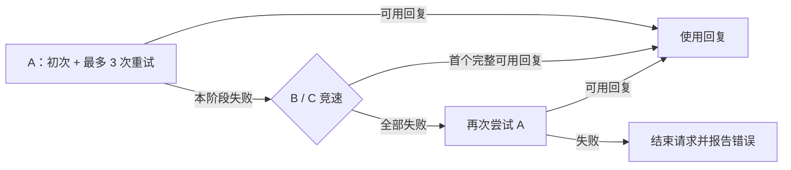

# LLM Core 请求重试与竞速

日期：2026-09-14。基准：`purpose-test-routing` @ `33ee24c06d129f2f1c177ffcbaf0a3213ef72d5c`。
本文记录本轮需求、实现边界和验收；不是发布公告。
实现目标版本为 llmcore `1.4.5`；CChat 的编译依赖、最低运行依赖和接口契约同步使用该版本。

## 本轮决定

最初只做计划，维护者随后授权实现重试逻辑。目标是在现有 Console routing 内组合重试、竞速与后续回退：

```text
A*3 > (B | C) > A
```

`*3` 明确表示首次请求失败后最多重试 3 次，即该阶段最多 4 次 HTTP 请求；重试受错误类型、可用凭据、预算和时限约束。
竞速阶段静默关闭流式传输，以首个完整且可用的回复为赢家，保持全局流式设置。

维护者已确认这次 Exposure / VISION 的 `All providers failed` 是 Console routing 未配置可用 provider。
该事件按配置问题收口；本轮不以它证明 CChat 存在 pending 缺陷，不改对话框、clear 命令或回合队列。
RC2 的阶段三、四拆分继续冻结。

## 使用方式

在 `/llm console` 的 Routing 页编辑默认路由或具体 purpose：

| 输入 | 行为 |
|---|---|
| `A` | 使用 A；同一阶段每个可用 key 最多尝试一次 |
| `A*0` | 仅尝试一次，不自动换 key 重试 |
| `A*3` | 初次加最多 3 次重试；换 key 也占用这个次数 |
| `A > B` | A 失败后进入 B |
| `(B \| C)` | 同时发给 B、C，使用首个合格的完整回复 |
| `A*3 > (B \| C) > A` | A 重试耗尽后竞速 B/C；全部失败后再次进入 A |
| `"含 > 的站点名"*1` | 用双引号引用包含路由符号的实际 provider 名 |
| 留空 | 继承默认路由；默认路由也为空时按现有规则使用全部 provider |

常用操作直接点击可用 provider，主界面显示阶段编号、重试倍数和竞速标记：

- 左键追加顺序阶段；连续左键同一候选三次得到 `A*3`。
  第一次保持单个 `A` 的自动换 key 行为；第二、三次分别设置 `*2`、`*3`（额外重试数）。
- 切到右键时开始下一阶段；连续右键 B、C 得到 `(B | C)`，同组重复点击不重复添加。
- 再次左键 A 追加后续阶段，组成 `A*3 > (B | C) > A`。
- 已选项左键直接移除，只删除该项；右键不会误删已选项，也不会触发保存或用途切换。
- 保存、切换用途、移除已选项或进入高级表达式后结束本次连续点击；滚动候选列表可以继续当前组合。

高级表达式默认折叠，需要时可以直接修改具体重试数或任意阶段。默认路由和 purpose 路由都有整单时限输入。
只修改温度、输出预算等参数不会丢失原有竞速结构。
整单时限可独立于 provider 设置：用途留空路由表达式时继承默认阶段，仍可覆盖时限；
用途时限留空则继承默认路由时限，默认路由时限留空使用 120 秒。



## 执行约束

- 路由是有界的阶段树：顺序回退，阶段内竞速，每个叶子有重试策略；不引入任意跳转或循环。
- 最多 16 个阶段，每个竞速阶段最多 8 个不同 provider，每个显式重试数为 0–10。
  一次逻辑请求最多 128 次尝试。默认整单时限 120 秒，可设置为 1–3600 秒。
- 既有 `timeoutSeconds` 仍是单次请求时限；整单时限包含重试退避、凭据冷却、所有阶段及搜索降级。
  超过整单时限后不启动新请求，也不接纳迟到的结果。
- 没写 `*` 的旧路由保留换 key 能力，同时通过本阶段已尝试集合阻止冷却结束后无界重复选 key。
  后续再次出现的 A 是独立阶段；不会被整单 provider 去重抹掉。
- 网络失败、408、429、5xx 可重试；401/403 禁用对应 key 后只可换其他可用 key。
  400 等确定性请求错误、解析失败、完整但不可用的回复不反复原样重发。
  暂时失败采用有上限的指数退避及少量抖动，尊重 `Retry-After` 与 key 冷却。
- 预算或策略拒绝是整单终态，不用重试或换站绕过。没有配置好的 provider/key 时快速给出可定位的错误。

竞速以完整 HTTP 响应体解析完成为准；收到响应头、首 token、reasoning 内容都不算胜出。
候选必须有非空正文，且 `finish_reason` 归一化后为 `stop`。空正文、截断、过滤或异常结束不能抢先获胜。
竞速期间不向消费者发 delta；OpenAI/Anthropic 请求显式使用 `stream=false`，Gemini 使用既有非流式传输路径。
成功只交付一次，其余尚未结束的候选取消；迟到结果不覆盖赢家。
普通单站流式请求已发出正文后发生错误时结束本轮，防止跨站拼接两份回复。

## 所有权、提示词与预算

`core` 持有协议、路由执行与 transport 取消；`llmcore-mod` 持有 provider、credential、配置、Console 与共享运行时。
运行时 reload/关闭取消旧实例仍在执行的请求。CChat 继续通过 `SharedLlmRuntime` 消费公开 API。

同一请求的所有候选使用相同的冻结 messages，不在竞速分支内重新裁剪提示词。
`finalizeDraftForRoute` 按所有可能接收者的最小输入预算完成一次裁剪，保留 purpose 本身的输入限制；
CChat 与 Console Test 同步使用它。CChat 返回的 capability included 决策因此仍对应实际发送的提示词。
图片 part 与 MIME/data URL 不做格式改写。

每次实际调用在 HTTP 前预留预算、结束时结算一次。下一次尝试与最终完成都依赖本次结算完成。
已返回的 usage 用真实值；已发出的竞速败者被取消或响应读取超时且 usage 未知时，保守记录 estimated tokens。
取消不代表供应商免费，也不当成模型成功回复。尚未获准发送的请求不扣费。

`estimateWorstCaseBudget(request)` 按完整阶段树计算，重复阶段和全部竞速候选都计入。
`estimateWorstCaseBudget(exchange)` 另覆盖 PREFERRED search 失败后的文字降级。
`estimateMaximumRouteBudget` 为跨 purpose 的 causal root 给出保守单轮上界；CChat 在此基础上保留自身的逻辑轮数上限。
这避免 selector/followup 等后续用途的较小估算把整链预算意外收窄。

Hosted Web Search 继续要求显式请求、purpose 授权及兼容 provider profile；竞速不会自动启用搜索。
REQUIRED 缺少调用证据时不能赢；PREFERRED 可以在同一时限和计费根下按原规则降级。
显式指定 provider 的 Java/llmjs 调用仍尊重显式链；目前 llmjs 默认脚本入口会选定 provider，
本轮不把其含义改成自动参与 Console 的 purpose 组合路由。

## 配置与公开契约

路由 JSON 保存为 schema 3，例如：

```json
{
  "schemaVersion": 3,
  "default": {"route": "A*3 > (B | C) > A", "deadlineSeconds": 120},
  "purposes": {
    "VISION": {"route": "(vision_a*1 | vision_b*1) > backup", "deadlineSeconds": 90}
  }
}
```

已存在的 schema 2 / 数组路由在读取时转换为同一内存结构；保存只写 schema 3。
不保留并行执行路线。Console 协议同步更新，避免旧客户端保存时把组合路由拍平成列表。
现有 `LlmRequest`、`send/sendStreaming`、三参数 `PriorityRoutingConfig` 构造器继续可用；
`resolveChain` 只作为实际 provider 名的只读投影，不参与组合路由执行。

## 验收范围

本地 HTTP 故障注入验证真实传输和状态顺序，重点覆盖：

- `A*3 > (B | C) > A` 的次数、并发与最终回访 A。
- 先收到响应头但响应体未完成的站点不抢先赢；竞速不产生 delta。
- HTTP 200 空正文、`length` 不能胜出；失败详情保留到 attempts。
- `Retry-After`、同步预算拒绝、预算结算顺序、竞速取消成本、整单时限和已输出 SSE 后失败。
- 左键 A 三次 → 右键 B、C → 左键 A，得到 `A*3 > (B | C) > A`；修改参数并保存后重试、竞速、重复 A 和时限不丢失。
- 继承默认 provider 时可独立设置时限；空正文和格式错误的 SSE 跳过同站重试，继续允许合法回退。
- CChat 的真实 prompt、included capability 决策和跨 purpose 预算上界保持对应。

自动验证使用 core 单测、Console/llmjs 定向编译及 CChat 受影响接缝测试；不调用真实收费 API。
Minecraft 内的 Console 编辑、真实多站竞速与 Exposure 对话体验仍需实际运行验收，不能由本地 HTTP 测试代替。

2026-09-14 实现验证已通过：AIjs `:core:test`，Console 的 `ConsoleTestExecutorTest`、
`ProviderManagerRuntimeTest`、`RoutingPanelLayoutTest`，以及 `:llmcore-mod:compileJava :compileJava`；
CChat 的 `CreatureChatLlmServiceRequestTests`、`FrozenContractTests` 与
`:common:compileClientJava :forge:compileJava :fabric:compileJava`。本轮未构建发布包或改动玩家 checklist。

## 后续再做

完整的路由图拖拽编辑、逐分支历史与成本视图、通用业务回复校验、任意嵌套工作流不属于本轮。
只有出现实际维护或使用需求时再扩展，不为了文件尺寸继续拆类。
如果再次出现失败后对话无法恢复，应采集当次 request/queue/response 标识和状态包，另立故障卡；
不能从本次已确认的配置问题推导一个未经复现的 pending 修复工程。

图片协议核对来源（2026-09-14）：[DeepSeek Vision](https://api-docs.deepseek.com/guides/vision)、
[Chat Completions](https://api-docs.deepseek.com/api/create-chat-completion)、
[Models](https://api-docs.deepseek.com/quick_start/pricing)。官方 Flash 接口支持当前图片构造所用的
`user.content[] / image_url / data:image/png;base64,... / detail:low`；第三方站点仍以实际 endpoint/model 为准。
